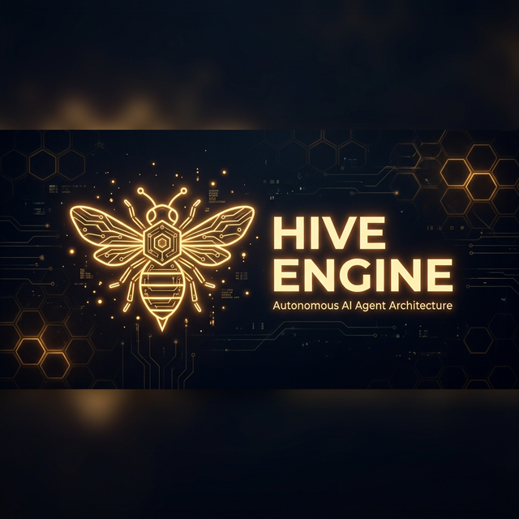

<p align="center">
  
</p>

<p align="center">
  <a href="https://discord.gg/KhjYX3U3AW"></a>
  
  
  
  
  
</p>

<h1 align="center">🐝 HIVE Engine</h1>

<p align="center">
  <strong>A sovereign, fully-local AI agent runtime written from the ground up in pure Rust.</strong><br/>
  No cloud dependencies. No API keys to OpenAI. No frameworks. Just raw systems engineering.
</p>

<p align="center">
  <a href="https://discord.gg/KhjYX3U3AW">
    
  </a>
</p>

---

## 🎯 What is HIVE?

HIVE is a **fully autonomous AI agent engine** that runs entirely on your hardware. It powers **Apis** — an AI persona that doesn't just answer questions, but *thinks*, *acts*, *remembers*, and *evolves*.

Unlike wrapper bots that relay messages to cloud APIs, HIVE is a **purpose-built cognitive runtime**:

- 🧠 **Multi-turn ReAct Loop** — Apis reasons, selects tools, observes results, and iterates autonomously. It decides when to stop, not the user.
- 🔒 **Memory-Level Security** — Per-user data isolation enforced at the architecture layer. Private data is *invisible* to other scopes — not by prompting, by design.
- 🗜️ **4-Phase Context Consolidation** — Automatically summarizes and injects synthetic memory events when working context nears 80% capacity to prevent thread fragmentation.
- 🛠️ **lots of Tool Drones** — Web search, code execution, native Git, LSP Code Intelligence, file I/O, image generation, TTS, PDF composition, process management, mesh status dashboard, and more — all running locally.
- ⏱️ **AutoResearch & Ratchets** — Define `.hive/directive.md` goals and HIVE will autonomously experiment with your codebase during idle time, mechanically rolling back any edits that break the build via Atomic Checkpoints.
- 📡 **Live Inference HUD** — Watch Apis think in real-time via streaming Discord embeds with reasoning tokens, tool activity, and performance telemetry.
- 🎓 **Self-Supervised Learning** — An integrated Teacher module captures preference pairs and golden examples for continuous improvement.
- 🕸️ **Decentralised Supercomputer** — P2P mesh with Wasm-sandboxed compute, Kademlia DHT, distributed file system, internet relay, and algorithmic HIVE Coin economy.
- ⚖️ **Sunset Governance** — Three-phase automatic power transition: Bootstrap (dev powers) → Council (multisig) → Democracy (1000+ peers, pure equality). Hardcoded and irreversible.
- 🔄 **Anti-Spiral Recovery** — Automatic detection and recovery from reasoning loops, with interruptible inference and thought-level safeguards.
- 👁️ **Observer Audit Module** — Every response is audited for confabulation, logical inconsistency, and lazy deflection before delivery.

> **Want to see it in action?** Apis is live right now. [**Join the Discord**](https://discord.gg/KhjYX3U3AW) and talk to it for free.

---

## 🏗️ Architecture

```
                          ┌──────────────────────────────────────────────────┐
                          │               🐝 HIVE ENGINE                    │
                          │                                                  │
   ┌──────────┐          │  ┌────────────┐   ┌──────────────┐              │
   │ Discord  │◄─Events─►│  │  ReAct     │◄─►│   Provider   │              │
   │ Platform │          │  │  Loop      │   │  (Ollama)    │              │
   └──────────┘          │  │            │   └──────────────┘              │
                          │  │  Think →   │                                 │
   ┌──────────┐          │  │  Act →     │   ┌──────────────┐              │
   │   CLI    │◄─Events─►│  │  Observe → │◄─►│   Memory     │              │
   │ Platform │          │  │  Repeat    │   │   Store      │              │
   └──────────┘          │  └────────────┘   │  (5-Tier)    │              │
                          │        │          └──────────────┘              │
   ┌──────────┐          │        ▼                                        │
   │ Glasses  │◄─Events─►│  ┌────────────┐   ┌──────────────┐             │
   │ Platform │          │  │  34 Tool   │   │  Observer    │             │
   └──────────┘          │  │  Drones    │   │  (Audit)     │             │
                          │  └────────────┘   └──────────────┘             │
   ┌──────────┐          │        │                                        │
   │ Telemetry│◄─Events─►│        ▼           ┌──────────────┐             │
   │ Platform │          │  ┌────────────┐   │  NeuroLease  │             │
   └──────────┘          │  │  Teacher   │   │  Mesh Net    │             │
                          │  │ (Self-Sup) │   │  (P2P Sync)  │             │
                          │  └────────────┘   └──────────────┘             │
                          └──────────────────────────────────────────────────┘
```

### The Stack

| Layer | What It Does |
|-------|-------------|
| **Platforms** | Trait-based I/O abstraction. Discord, CLI, Glasses, and Telemetry ship out of the box. Adding Telegram or Slack = one `impl Platform`. |
| **ReAct Loop** | Autonomous multi-turn reasoning engine with anti-spiral detection. Apis selects tools, reads observations, recovers from reasoning loops, and decides its own next action. |
| **Tool Drones** | 39 native capabilities spanning information retrieval, code execution, multi-modal generation, memory management, mesh dashboard, and system automation. |
| **Memory Store** | 5-tier persistence: Working Memory → Scratchpad → Timeline → Synaptic Graph → Lessons. All scope-isolated with compile-time access gates. |
| **Provider** | Local LLM integration via Ollama with streaming token extraction, `<think>` tag parsing, vision support, and interruptible inference. |
| **Observer** | Post-generation audit module that catches confabulation, lazy deflection, logical inconsistency, and architectural leakage before delivery. |
| **Teacher** | Captures reasoning traces, evaluates response quality, and generates preference pairs for RLHF-style continuous improvement. |
| **NeuroLease** | Decentralised supercomputer mesh: Wasm-sandboxed compute, Kademlia DHT storage, distributed file system, internet relay, intelligent job routing, and peer-to-peer weight sharing. |
| **SafeNet** | Survival platform: web proxy, compute pooling, connection sharing, content security, sunset governance (Bootstrap→Council→Democracy), crisis response, and offline mesh — all P2P over QUIC. |
| **Kernel** | Core identity protocols: Zero Assumption Protocol, Anti-Gaslighting, Contradiction Resolution, Continuity Recovery, and the full governance constitution. |
| **HIVE Coin** | Algorithmic cryptocurrency: 1 coin/block, halves every 100K blocks. Earned by contributing compute, relay, and storage. No human controls supply. |

---

## 🛠️ The 39 Tool Drones

Apis has access to a full arsenal of native capabilities, all running **locally on your machine**:

<table>
<tr>
<td width="50%">

**🌐 Information & Research**
- `web_search` — Brave-powered web search
- `researcher` — Deep analysis of search results
- `codebase_list` / `codebase_read` — Project introspection
- `read_attachment` — Discord CDN file ingestion
- `channel_reader` — Pull conversation history
- `read_logs` — System log inspection
- `download_tool` — Direct URL downloads

</td>
<td width="50%">

**🧠 Memory & Knowledge**
- `manage_user_preferences` — Per-user preference tracking
- `store_lesson` — Permanent knowledge retention
- `manage_scratchpad` — Session working memory
- `core_memory` — Persistent identity state
- `operate_synaptic_graph` — Associative knowledge links
- `review_reasoning` — Introspect own reasoning traces
- `timeline_tool` — Temporal event management

</td>
</tr>
<tr>
<td>

**⚡ Execution & Creation**
- `operate_turing_grid` — 3D computation sandbox
- `run_bash_command` — Direct shell execution
- `process_manager` — Background daemon orchestration
- `file_system_operator` — Native filesystem I/O (with Automic Checkpoints)
- `file_writer` — PDF/document composition with themes
- `compiler_tool` — Compile and verify code
- `opencode` — Sub-agent IDE orchestration
- `tool_forge` — Dynamic tool creation at runtime
- `git` — Native 11-action source control
- `lsp` — IDE-grade language server intelligence
- `ratchet` — AutoResearch experiment evaluation

</td>
<td>

**🎨 Multi-Modal & Automation**
- `image_generator` — Local Flux image generation with vision cache
- `kokoro_tts` — Neural text-to-speech (🔊 Speak button on Discord)
- `synthesizer` — Multi-source fan-in compilation
- `manage_routine` / `manage_skill` — Automation & script management
- `email_tool` — SMTP email composition
- `calendar_tool` — Event scheduling
- `contacts_tool` — Contact management
- `smarthome_tool` — IoT device control
- `goal_planner` — Hierarchical goal decomposition
- `emoji_react` — Discord native reactions

</td>
</tr>
</table>

---

## 🔒 Security Model

HIVE enforces privacy at the **memory layer**, not the prompt layer. This means prompt injection attacks cannot leak private data — the LLM literally never sees it.

```
  Public Scope              Private Scope (Alice)       Private Scope (Bob)
┌─────────────────┐      ┌─────────────────────┐     ┌─────────────────────┐
│   #general      │      │   DM with Alice      │     │   DM with Bob       │
│                 │      │                     │     │                     │
│ Memory Access:  │      │ Memory Access:      │     │ Memory Access:      │
│ • Public only   │      │ • Public ✓          │     │ • Public ✓          │
│                 │      │ • Alice's data ✓    │     │ • Bob's data ✓      │
│                 │      │ • Bob's data ✗ NEVER│     │ • Alice's data ✗    │
└─────────────────┘      └─────────────────────┘     └─────────────────────┘
```

Every memory query passes through `Scope::can_read()` — a compile-time enforced gate that filters data **before** it reaches the LLM context window.

---

## 🌐 Decentralised Supercomputer & SafeNet

Every HIVE instance is a node in a decentralised P2P supercomputer. Together, they form a single distributed computer with shared compute, data, internet access, and an algorithmic economy.

### Distributed Compute

| Feature | How It Works |
|---|---|
| **Inference Routing** | AI requests route to the best peer by model match, latency, slots, queue depth, region |
| **Batch Processing** | Large jobs fan out to N peers in parallel, results aggregate automatically |
| **Wasm Sandbox** | Compile any program to WebAssembly — runs on peer hardware in full isolation (no filesystem, no network, memory/CPU capped) |
| **Priority** | Your local work always comes first. Remote jobs pause at 80% CPU, kill at 90% |
| **Internet Relay** | Offline peers route web requests through connected peers with ephemeral IDs |

### Distributed Data

| Feature | How It Works |
|---|---|
| **Kademlia DHT** | Content-addressed storage distributed by XOR distance, K=3 replication |
| **File Chunking** | Files split into 256KB chunks, stored across multiple peers, retrieved in parallel |
| **Content Store** | Disk-backed with SHA-256 integrity, LRU eviction, pinning for critical data |
| **Privacy** | File names encrypted — peers storing chunks can't see what they hold |

### Sunset Governance

| Phase | Peers | Developer Powers |
|---|---|---|
| **Bootstrap** | 0–9 | Emergency access (unban, hotfix). All actions logged and broadcast. |
| **Council** | 10–999 | Creator + elected council must agree (2-of-3 multisig). |
| **Democracy** | 1000+ | Developer key = one vote. Pure equality. No individual overrides. |

Transitions are **automatic and hardcoded** — when peer_count reaches the threshold, powers disappear. Config-guarded code prevents modification.

### HIVE Coin Economy

- **Algorithmic minting**: 1 HIVE/block, halves every 100,000 blocks. No human controls supply.
- **Earned by**: running inference, relaying web requests, storing DHT data, running sandbox jobs
- **Proportional distribution**: rewards weighted by contribution

### Core Components

| Component | Port | Purpose |
|---|---|---|
| Web Proxy | `:8480` | Censorship-resistant browsing with mesh relay fallback |
| Human Mesh | `:9877` | P2P discovery and communication |
| Apis-Book | `:3031` | Read-only dashboard (one-way mirror into AI mesh) |
| HiveSurface | `:3032` | Decentralised social web |
| Apis Code | `:3033` | AI-powered web IDE |
| HiveChat | `:3034` | Discord clone — servers, channels, DMs |
| HivePortal | `:3035` | Mesh homepage — search, services, registry |
| Content Filter | — | 4-layer security: hash-blocking, injection detection, rate limiting, reputation |
| Governance | — | Sunset phases, community ban voting, emergency alerts, OSINT sharing |
| Offline Mesh | — | Store-and-forward with 72h TTL, connectivity monitoring |
| Pool Manager | — | Round-robin web relay, compute node selection, job lifecycle |
| Compute Relay | — | 6-layer security pipeline for serving mesh inference |
| Sandbox Engine | — | Wasm execution with fuel-based CPU limiting, priority management |
| DHT + Content Store | — | Kademlia distributed storage with disk persistence |
| Distributed File System | — | Chunked file sharing with parallel retrieval |

---

## 🕸️ NeuroLease Protocol

HIVE instances discover, authenticate, and synchronize via the **NeuroLease** peer-to-peer protocol:

- **Binary Attestation** — Each peer proves integrity through cryptographic verification of its compiled binary
- **Trust Propagation** — Peers establish trust through challenge-response verification
- **Weight Synchronization** — Learned weights and preference data propagate across the mesh
- **Intelligent Routing** — Jobs scored by model match ×  latency ×  slots ×  queue depth ×  region
- **Batch Fan-Out** — Parallelisable jobs distributed across N peers with result aggregation
- **Task Queue** — Priority-ordered, deduplicated, persistent job queue with retry logic
- **Kademlia DHT** — Content-addressed distributed storage with K-replication
- **Wasm Sandbox** — Secure general-purpose compute on peer hardware
- **Integrity Watchdog** — Continuous self-destruct monitoring for tampered instances
- **Adversarial Hardening** — Built-in tests for common mesh attack vectors

---

## 📡 Live Inference HUD

When Apis processes your message, you can watch it think in real-time:

```
┌───────────────────────────────────────────────┐
│ 🧠 Thinking... (4s elapsed)                  │
│                                               │
│ The user is asking about quantum computing.   │
│ I should search for recent breakthroughs      │
│ and cross-reference with my stored lessons... │
│                                               │
│ 🔧 Using: web_search, researcher             │
│ 📊 Turn 2 of 5                               │
└───────────────────────────────────────────────┘
         ↓ (streams every 800ms)
┌───────────────────────────────────────────────┐
│ ✅ Complete (18s · 3 turns · 4 tools used)    │
│                                               │
│ Full reasoning chain preserved for review     │
└───────────────────────────────────────────────┘
```

---

## 👁️ Observer & Kernel Governance

HIVE doesn't just generate — it **audits itself** before every response:

| Protocol | What It Does |
|----------|-------------|
| **Observer Module** | Post-generation audit that catches confabulation, lazy deflection, and logical inconsistency before delivery |
| **Zero Assumption Protocol** | Never assume — verify every claim via tools before stating it as fact |
| **Anti-Gaslighting** | Refuse to accept blame that evidence doesn't support, regardless of user pressure |
| **Anti-Spiral Recovery** | Detect and break circular reasoning loops automatically, re-prompting with recovery context |
| **Continuity Recovery** | Resume interrupted sessions with full state restoration from persistent memory |
| **Contradiction Resolution** | When encountering circular dependencies, act immediately rather than re-analyzing |

---

## 🚀 Quick Start

### Option A: One-Click Docker Launch (Recommended)

Everything is handled for you — Docker install, container build, model download, browser launch.

```bash
git clone https://github.com/MettaMazza/HIVE.git
cd HIVE
./launch.sh
```

That's it. The script will:
1. ✅ Install Docker if you don't have it
2. ✅ Start Docker if it's not running
3. ✅ Build HIVE from source in a container
4. ✅ Download the AI model automatically
5. ✅ Launch all mesh services
6. ✅ Open HivePortal in your browser

**Stop:** `./launch.sh stop` · **Rebuild:** `./launch.sh rebuild` · **Logs:** `docker logs -f hive-mesh`

### Option B: Native (No Docker)

```bash
# Prerequisites: Rust (rustup.rs) + Ollama (ollama.ai)
git clone https://github.com/MettaMazza/HIVE.git
cd HIVE
cp .env.example .env    # Edit with your tokens
ollama pull qwen3.5:35b
cargo run --release     # HivePortal opens automatically
```

### CLI-Only Mode

Don't want to set up Discord? HIVE runs in terminal mode by default:

```bash
cargo run --release
# > HIVE CLI initialized. Type your message to Apis.
# > Hello!
# Apis: Hey! I'm Apis, the core logic loop. What's on your mind?
```

---

## 📊 Project Stats

| Metric | Value |
|--------|-------|
| **Language** | 100% Rust |
| **Source Modules** | 155+ |
| **Lines of Code** | 58,000+ |
| **Unit Tests** | 600+ (all passing) |
| **Compiler Warnings** | 0 |
| **External AI APIs** | 0 (fully local via Ollama) |
| **Frameworks Used** | 0 (pure trait-based architecture) |
| **Platforms** | Discord · CLI · Glasses · Telemetry |
| **Memory Tiers** | Working → Scratchpad → Timeline → Synaptic → Lessons |
| **Mesh Services** | 18 (transport, proxy, pool, compute, sandbox, DHT, content store, distributed FS, governance phases, task queue, offline, chat, book, surface, code, hivechat, portal, marketplace) |

---

## ⚙️ Configuration

| Variable | Required | Description |
|----------|----------|-------------|
| `DISCORD_TOKEN` | For Discord | Bot token from Developer Portal |
| `BRAVE_SEARCH_API_KEY` | No | Enables `web_search` tool |
| `HIVE_MODEL` | No | Specify Ollama model (default: `qwen3.5:35b`) |
| `OLLAMA_BASE_URL` | No | Ollama endpoint (default: `http://localhost:11434`) |
| `HIVE_AUTONOMY_CHANNEL` | No | Discord channel ID for autonomous operation |
| `RUST_LOG` | No | Log verbosity (default: `info`, try `RUST_LOG=debug`) |
| `HIVE_PYTHON_BIN` | No | Path to Python for image generation |
| `REMOVED_MESH_GOVERNED` | No | Web relay sharing (default: `true` — equality) |
| `REMOVED_MESH_GOVERNED` | No | Compute sharing (default: `true` — equality) |
| `REMOVED_MESH_GOVERNED` | No | Max concurrent remote jobs (default: `2`) |
| `REMOVED_MESH_GOVERNED` | No | Token rate limit for remote peers (default: `50000`) |
| `HIVE_MESH_CHAT_DISCORD_CHANNEL` | No | Discord channel for mesh-to-Discord bridge |
| `REMOVED_MESH_GOVERNED` | No | Enable credits system (default: `true`) |
| `REMOVED_MESH_GOVERNED` | No | Welcome bonus credits for new users (default: `100`) |
| `REMOVED_MESH_GOVERNED` | No | Credits earned per 1000 compute units (default: `2.0`) |
| `REMOVED_MESH_GOVERNED` | No | Credits earned per 100 network requests (default: `1.0`) |
| `REMOVED_MESH_GOVERNED` | No | Credits earned per idle hour (default: `0.5`) |
| `REMOVED_MESH_GOVERNED` | No | Multiplier during high demand (default: `1.5`) |
| `REMOVED_MESH_GOVERNED` | No | Max daily social shares (default: `5`) |
| `REMOVED_MESH_GOVERNED` | No | Goods & services marketplace port (default: `3038`) |
| `REMOVED_MESH_GOVERNED` | No | Max listings per peer (default: `50`) |

---

## 🧪 Testing

```bash
cargo test --all
```

600+ tests covering: memory isolation, scope filtering, provider streaming, JSON repair, tool execution, platform routing, atomic checkpoints, ratchet auto-research, LSP integration, context consolidation, native git tools, adversarial mesh attacks, moderation, prompt integrity, resource pooling, compute relay, equality enforcement, content security, governance voting, sunset governance phases, Wasm sandbox execution, distributed compute routing, Kademlia DHT, content-addressed storage, distributed file system chunking, priority management, batch fan-out, task queue deduplication, social feed, post store, web IDE, path traversal security, chat servers, messaging, DMs, reactions, site registry, and more.

---

## 🗺️ Roadmap

- [x] ~~Multi-agent swarm orchestration~~ → Sub-agent spawning system
- [x] ~~NeuroLease mesh networking~~ → P2P weight sharing with attestation
- [x] ~~Observer audit module~~ → Pre-delivery confabulation detection
- [x] ~~Anti-spiral recovery~~ → Thought loop detection and re-prompting
- [x] ~~SafeNet decentralised mesh~~ → Web proxy, governance, crisis response, offline mesh
- [x] ~~Resource pooling~~ → Decentralised web connection + compute sharing
- [x] ~~Decentralised governance~~ → Sunset phases (Bootstrap → Council → Democracy at 1000 peers)
- [x] ~~Algorithmic economy~~ → HIVE Coin with deflationary halving schedule
- [x] ~~Distributed compute~~ → Intelligent routing, batch fan-out, task queue
- [x] ~~Wasm sandbox~~ → Secure general-purpose compute on peer hardware
- [x] ~~Distributed data~~ → Kademlia DHT, content-addressed storage, chunked file system
- [ ] Telegram platform adapter
- [ ] Fine-tuning pipeline from Teacher preference pairs
- [ ] Plugin system for community tool drones
- [ ] Mobile companion app (Glasses WebSocket API ready)

---

## 🤝 Contributing

HIVE is open source and contributions are welcome. Whether it's a new platform adapter, a tool drone, or a bug fix — open a PR and let's build.

---

<p align="center">
  <a href="https://discord.gg/KhjYX3U3AW">
    
  </a>
</p>

<p align="center">
  <strong>HIVE Engine</strong> — Pure Rust. Fully Local. Zero Compromises.<br/>
  <sub>Built with 🔥 by <a href="https://github.com/MettaMazza">MettaMazza</a></sub>
</p>
